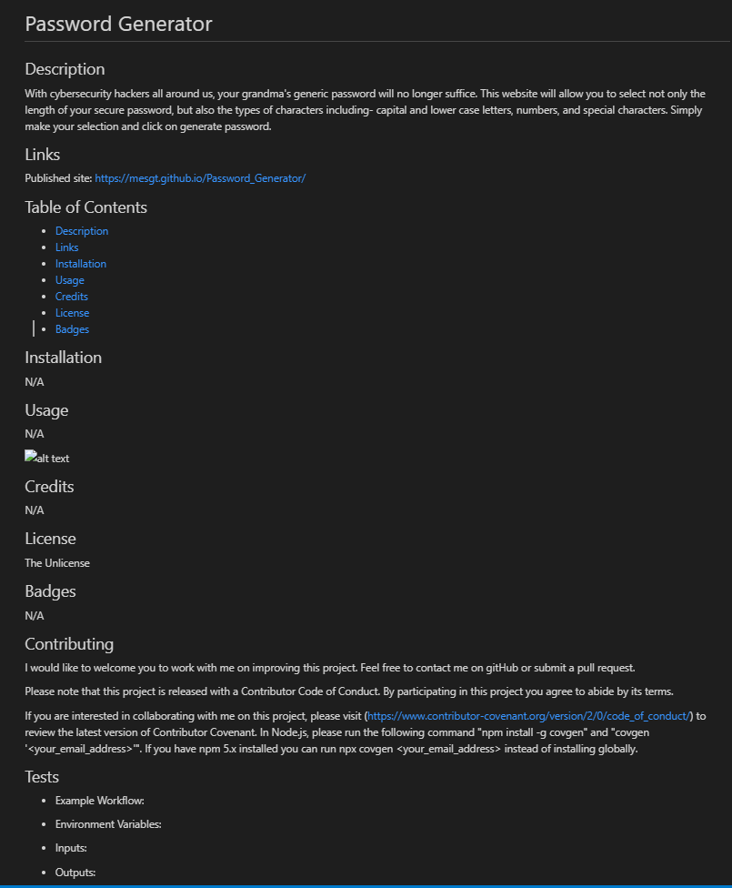

# ReadMe Generator

Easy and convenient way to build your ReadMe files for any project. 

## Deployed Link

https://mesgt.github.io/readme_generator/

# Application Details

## Purpose

Documentation can be a chore for many developers. The goal of this app was to make ReadMe documentation a little easier.

## Description

This app was developed to increase documentation efficiency, and allow for consistency throughout all ReadMe files. The user is asked a series of questions via terminal and the responses and the applicable headings are then displayed with the file name 'README_1.md'. The user can further modify the file if necessary. The code is written using NodeJS with inquirer and fs packets. 

 

## Technologies

<li>NodeJS </li>
<li>Inquirer </li>

## Usage
Open internal terminal for index.js and run "node index.js" command. Answer questions when prompted. The file can be further edited following rendering.

## Future Development

Ideas for future development include:
1. Generated ReadMe output stored in an output file for user to easily locate
2. ReadMe file name to be the project title to prevent previously generated ReadMe from being over-written 

## License

Licensed under the [MIT](https://opensource.org/licenses/MIT) license.

## GitHub 

https://github.com/mesgt/readme_generator

## Contributing

I would like to welcome you to work with me on improving this project. Feel free to contact me on gitHub or submit a pull request.

Please note that this project is released with a Contributor Code of Conduct. 
By participating in this project you agree to abide by its terms. 

If you are interested in collaborating with me on this project, please visit (https://www.contributor-covenant.org/version/2/0/code_of_conduct/) to review the latest version of Contributor Covenant. In Node.js, please run the following command "npm install -g covgen" and "covgen '<your_email_address>'". If you have npm 5.x installed you can run npx covgen <your_email_address> instead of installing globally.

